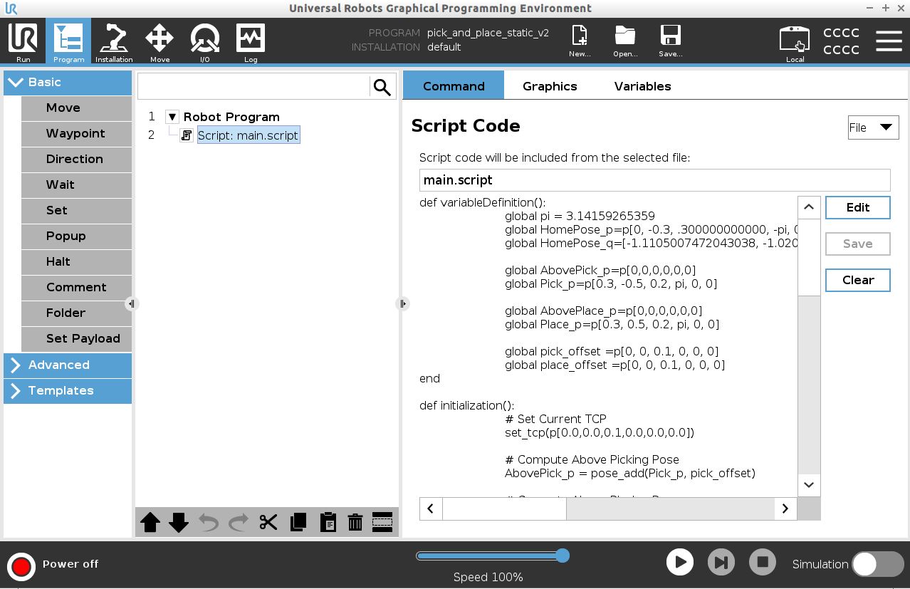

# URScript Tutorials
Tutorials for programming UR robots using URScript files.

## Simulating UR robots
If you do not have a UR robot, you can use its simulation by downloading a virtual machine containing the simulation of the robot and the controller.
For an e-Series robot, you can download the version 5.12.6 LTS of Polyscope from the following link:
- [OFFLINE SIMULATOR - E-SERIES - UR SIM FOR NON LINUX 5.12.6 LTS](https://www.universal-robots.com/download/software-e-series/simulator-non-linux/offline-simulator-e-series-ur-sim-for-non-linux-5126-lts/)

## Programming Manual Reference
The URScript programming manual is available from the following link
- [SCRIPT MANUAL - E-SERIES - SW 5.12](https://www.universal-robots.com/download/manuals-e-seriesur20ur30/script/script-manual-e-series-sw-512/)

## Guidelines
URScript is a python-based scripting launguage.
### Adding a URScript to the Robot program
1. From Main Panel select: `Program -> Adavnced -> Script`
2. Add the script to the `Robot Program` and select the file containing the instructions

    

